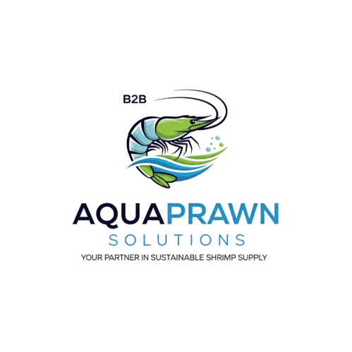

# AquaPrawn Solutions

<p align="center">
  
</p>

AquaPrawn Solutions is a database-backed B2B seafood ordering web application developed as an academic information-systems project. The application combines customer account management, product browsing, quote requests, order placement, order history, and inventory-backed workflows in an ASP.NET Web Forms interface.

## Tech Stack

- C#
- ASP.NET Web Forms
- ADO.NET
- SQL / SQL Server
- HTML / CSS
- Visual Studio
- .NET Framework 4.7.2

## Core Functionality

- Customer registration and login
- Session-based authenticated user flows
- Customer profile viewing, updating, and account deletion
- Product/catalog browsing
- Quote-request workflow
- Order placement with order-header and line-item creation
- Inventory quantity updates during ordering
- Customer order history and order-detail views

## My Contributions

This project was originally developed by a five-person academic team. My contributions focused on full-stack development and user-facing workflows, including:

- Contributing to the application structure and UX/UI for product browsing, customer accounts, and ordering workflows.
- Implementing and debugging customer registration, login/authentication, profile updates, and account-deletion functionality using C#, ASP.NET session management, ADO.NET, and SQL-backed controls/queries.
- Building and debugging transactional ordering workflows that create customer orders and line items, retrieve inventory data, update inventory quantities, and connect application logic to SQL-backed interfaces.

This repository is maintained as a personal portfolio copy and does **not** claim sole authorship of the entire codebase.

## Repository Structure

```text
AquaPrawn-Solutions/
├── Aquaprawn.sln
├── Aquaprawn/
│   ├── *.aspx / *.aspx.cs     # Web Forms pages and code-behind
│   ├── Site1.Master           # Shared page layout/navigation
│   ├── StyleSheet1.css        # Application styling
│   ├── images/                # Project visual assets
│   ├── Web.config             # Sanitized local database configuration
│   └── Aquaprawn.csproj
├── .gitignore
└── README.md
```

## Local Setup

This repository is a portfolio-oriented copy of the project. The original hosted course database is **not** included.

1. Open `Aquaprawn.sln` in Visual Studio on Windows with ASP.NET/.NET Framework development tools installed.
2. Restore the NuGet packages referenced by `packages.config`.
3. Create or connect a SQL Server database containing the tables expected by the application.
4. Update the `AquaPrawnConnectionString` entry in `Aquaprawn/Web.config` for your local SQL Server environment.
5. Run the project through IIS Express / Visual Studio.

The committed `Web.config` contains only a non-secret LocalDB example connection string.

## Academic & Security Notes

- This is an educational project preserved for portfolio review, not a production application.
- Environment-specific database credentials from the original course deployment have been removed from this public copy.
- The original database schema and production/course data are not included in this repository.
- Authentication and payment-related handling were implemented for a classroom demonstration and are **not production-hardened**. A real deployment should use modern password hashing, secure secret management, payment tokenization through a compliant provider, stronger validation, and a full security review.
- Before republishing project assets, collaborators should confirm that the team has permission to share the code and included imagery publicly.

## Why This Project Matters

AquaPrawn demonstrates the connection between business requirements and implementation: translating customer/account/order workflows into a working database-backed application, integrating UI behavior with persistent data, and debugging multi-step transactional processes across the application and SQL layer.
