# AquaPrawn Solutions

<p align="center">
  
</p>

<p align="center">
  <strong>A database-backed B2B seafood ordering platform built around customer accounts, commercial quote requests, inventory, and order fulfillment.</strong>
</p>

<p align="center">
  <code>C#</code> · <code>ASP.NET Web Forms</code> · <code>SQL Server</code> · <code>ADO.NET</code> · <code>HTML</code> · <code>CSS</code> · <code>.NET Framework 4.7.2</code>
</p>

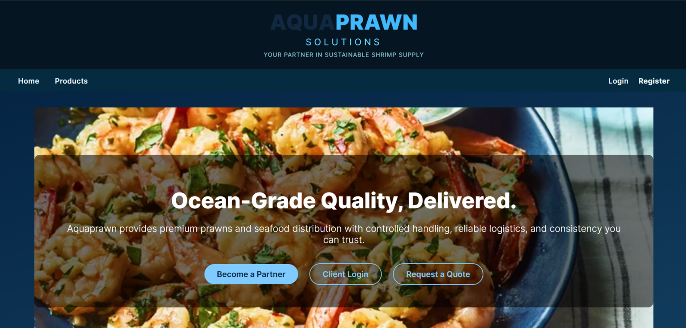

## Project Overview

AquaPrawn Solutions was developed by a five-person academic team as an information-systems project for a fictional Midwest-based B2B shrimp supplier. The application translates a commercial procurement workflow into a working web experience: prospective buyers can browse products or request a quote, while registered customers can manage their accounts, place orders, and review purchase details.

This repository is a personal portfolio copy. This portfolio copy includes a debug-only presentation mode that recreates authenticated UI states with local demo data when the original course database is unavailable. The original SQL-backed application paths remain in the codebase.

| Project detail | Description |
| --- | --- |
| My role | UI/UX Designer and Full-Stack Contributor |
| Team | Five students |
| Application type | ASP.NET Web Forms business application |
| Primary users | Restaurant, grocery, institutional, and distribution buyers |
| Core workflows | Account management, quotes, product ordering, inventory, and order history |

## My Contributions

- **Designed the complete user interface and visual system** across the public storefront, authentication, customer accounts, catalog, quote, checkout, order-history, and confirmation experiences.
- Defined the interaction flow between guest and authenticated states, including conditional navigation, account menus, calls to action, validation feedback, modals, success states, and lightweight animations.
- Contributed extensively to the C# and ASP.NET Web Forms implementation, connecting page controls and code-behind logic to session state and SQL-backed workflows.
- Implemented and debugged customer registration, login, profile modification, and account-deletion operations using ASP.NET controls, ADO.NET, SQL queries, and session management.
- Collaborated on the order and inventory experience, translating business requirements into customer-facing forms, order-history views, and data-driven interfaces.
- Restored the archived application for local portfolio review and added an isolated debug-only demo layer without removing the original database logic.

This was a collaborative academic project; this portfolio copy does **not** claim sole authorship of the complete codebase.

## Product Walkthrough

### Public storefront

The public experience introduces the supplier's value proposition, presents commercial product tiers, and routes prospects toward either registration or a quote request.

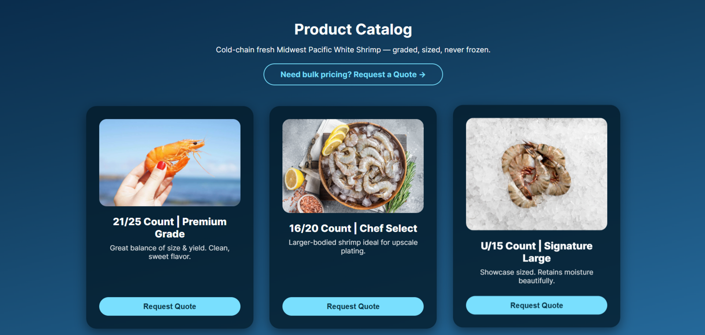

### Authentication and customer accounts

Guest navigation changes after authentication to expose account tools and customer-specific purchasing actions. The account area consolidates identity, organization, contact, and membership information.

<p align="center">
  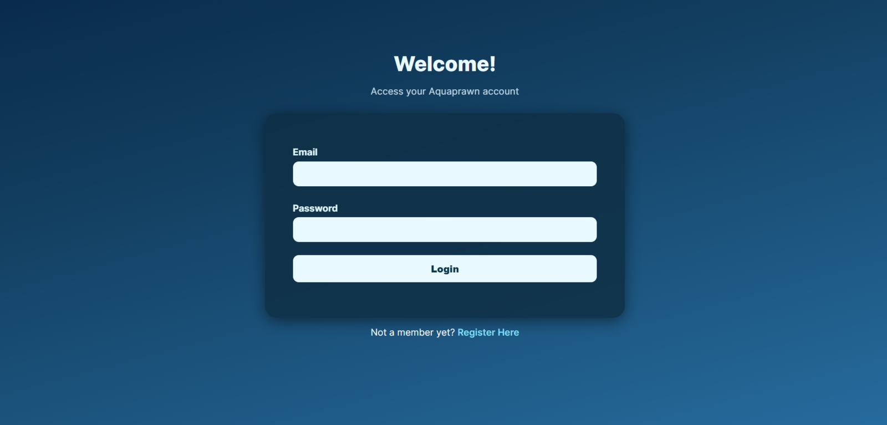
  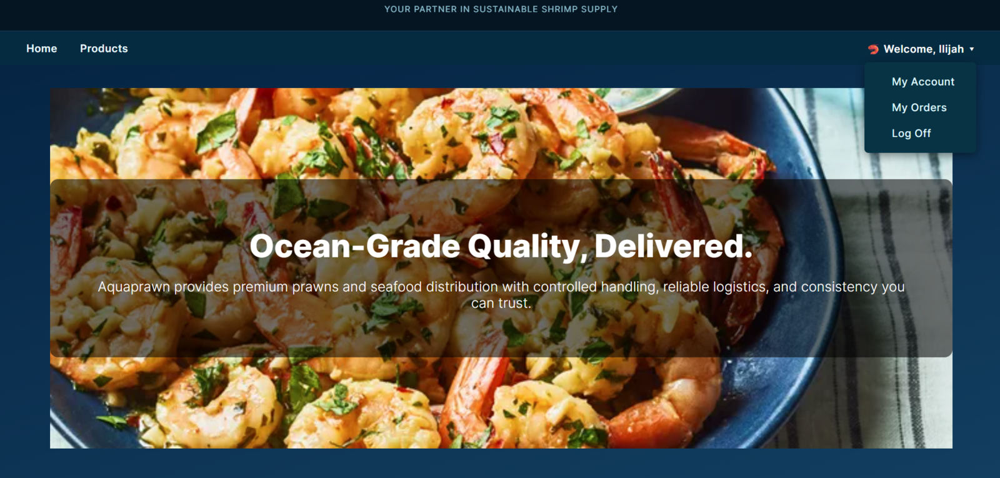
</p>

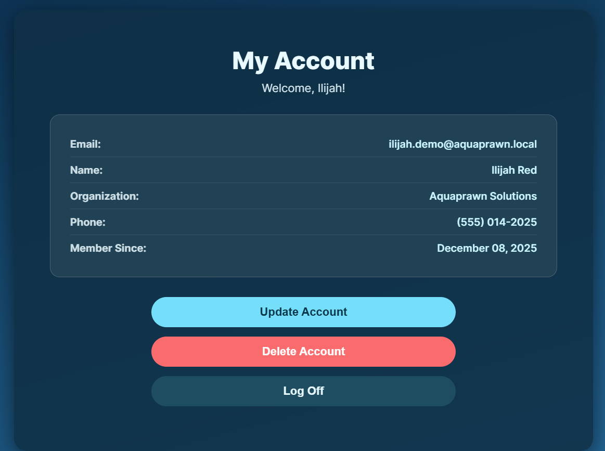

### Ordering and fulfillment

Authenticated customers can select inventory quantities, provide shipping and payment information, confirm an order, and review previous purchases.

<p align="center">
  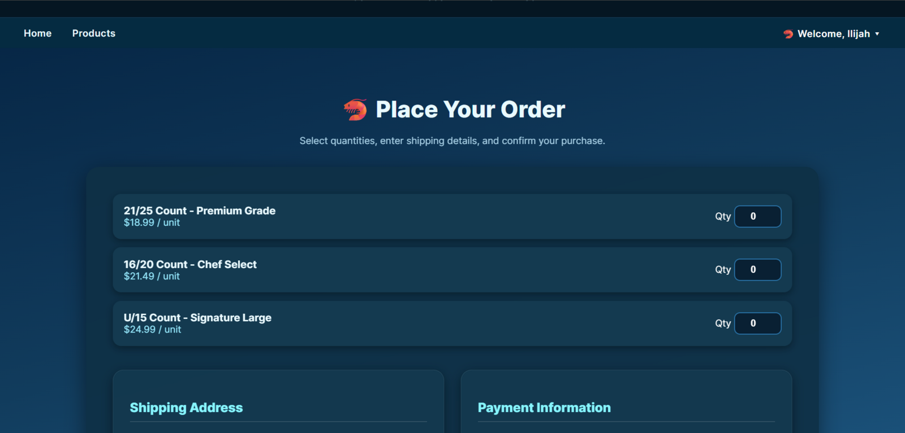
  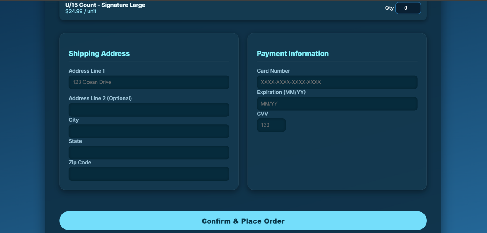
</p>

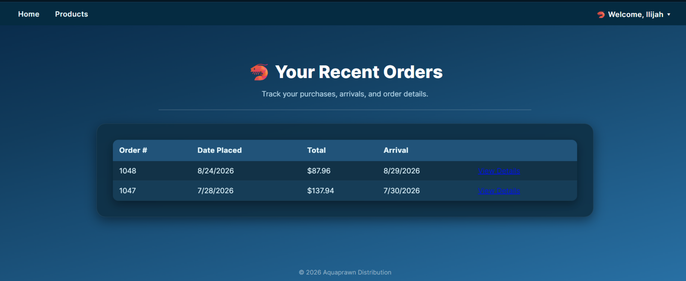

<p align="center">
  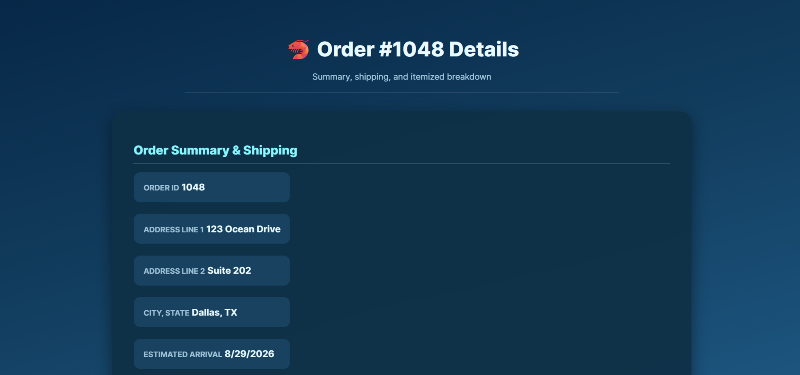
  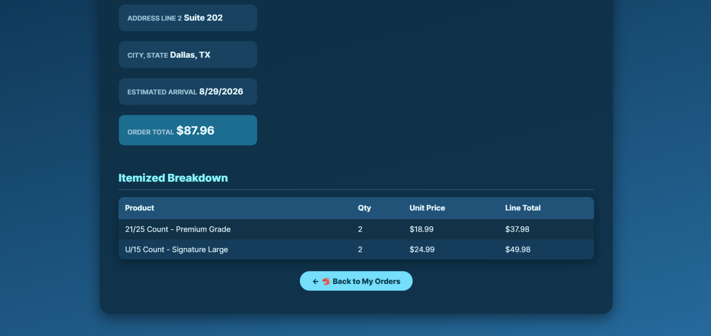
</p>

### Commercial quote workflow

Prospective buyers who are not ready to create an account can submit their organization and phone number for customized bulk pricing.

<p align="center">
  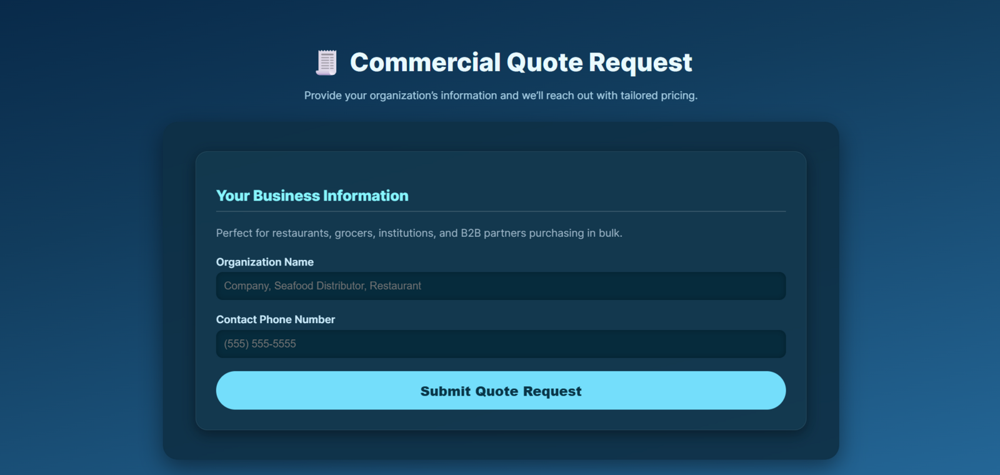
  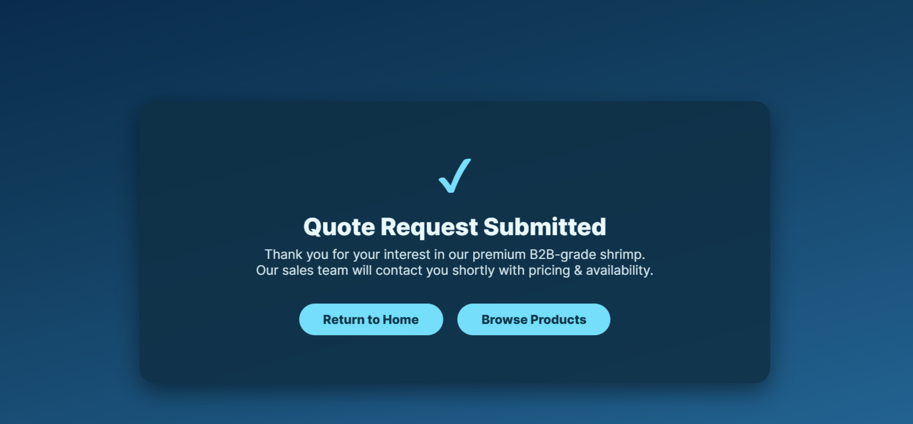
</p>

## User Journey

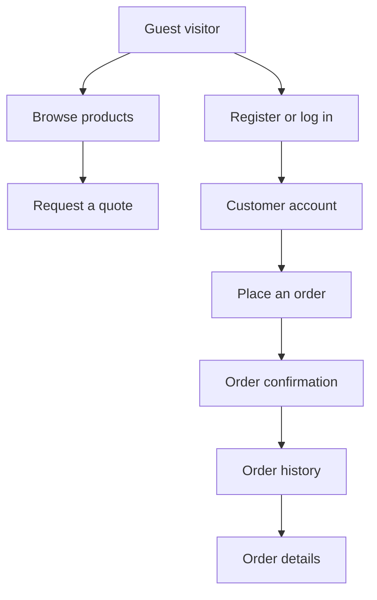

## Core Functionality

- Customer registration, login, logout, and session-based navigation
- Customer profile viewing, modification, and account deletion
- Public product catalog with authentication-aware calls to action
- Commercial quote submission workflow
- Inventory-backed product selection and quantity entry
- Shipping and payment-information collection
- Order-header and line-item creation
- Inventory quantity updates during ordering
- Customer order history and itemized order-detail views
- Animated confirmation, welcome, and success states

## Technical Implementation

| Layer | Technologies and responsibilities |
| --- | --- |
| Interface | HTML, CSS, ASP.NET server controls, master-page navigation, modal and toast states |
| Application | C# code-behind, page lifecycle events, validation, sessions, redirects, and transaction flow |
| Data access | ADO.NET, `SqlConnection`, `SqlCommand`, `SqlDataReader`, and `SqlDataSource` controls |
| Database | SQL Server tables for customers, prospects, inventory, orders, and order items |
| Runtime | .NET Framework 4.7.2, IIS Express, Visual Studio, and NuGet |

## Repository Structure

```text
AquaPrawn-Solutions/
├── Aquaprawn.sln
├── Aquaprawn/
│   ├── *.aspx                 # Web Forms page markup
│   ├── *.aspx.cs              # C# code-behind
│   ├── Site1.Master           # Shared layout and conditional navigation
│   ├── StyleSheet1.css        # Shared application styling
│   ├── images/                # Brand and product assets
│   ├── Web.config             # Local application configuration
│   └── Aquaprawn.csproj
├── docs/screenshots/          # Portfolio walkthrough images
└── README.md
```

## Run the Portfolio Demo

### Requirements

- Windows
- Visual Studio with the **ASP.NET and web development** workload
- .NET Framework 4.7.2 targeting pack/SDK
- IIS Express

### Setup

1. Clone this repository.
2. Open `Aquaprawn.sln` in Visual Studio.
3. Restore the packages listed in `packages.config`.
4. Build the solution.
5. Run the project through IIS Express using the **Debug** configuration.

If ASP.NET reports that `bin\roslyn\csc.exe` is missing, open the Package Manager Console and run:

```powershell
Update-Package Microsoft.CodeDom.Providers.DotNetCompilerPlatform -Reinstall
```

### Demo behavior

- Select **Login** and press the login button to enter the authenticated demo experience.
- Registration, quote, update, delete, and order submissions route to their original success states without requiring the archived course database.
- Account, inventory, purchase-history, and order-detail pages use representative in-memory data only in Debug mode.
- Non-demo database paths and SQL operations remain in the project for implementation review.

## Academic and Security Notes

- The original hosted course database, schema, and production/course data are not included.
- `Web.config` contains only a non-secret LocalDB example connection string.
- Authentication and payment handling were designed for a classroom demonstration and are **not production-hardened**.
- A real deployment would require password hashing, secure secret management, server-side validation, authorization checks, payment tokenization through a compliant provider, and a comprehensive security review.

## Why This Project Matters

AquaPrawn demonstrates how I translate business requirements into an end-to-end digital product: defining the interface and interaction model, connecting user actions to application and database logic, and debugging multi-step workflows across the presentation, application, and data layers.
